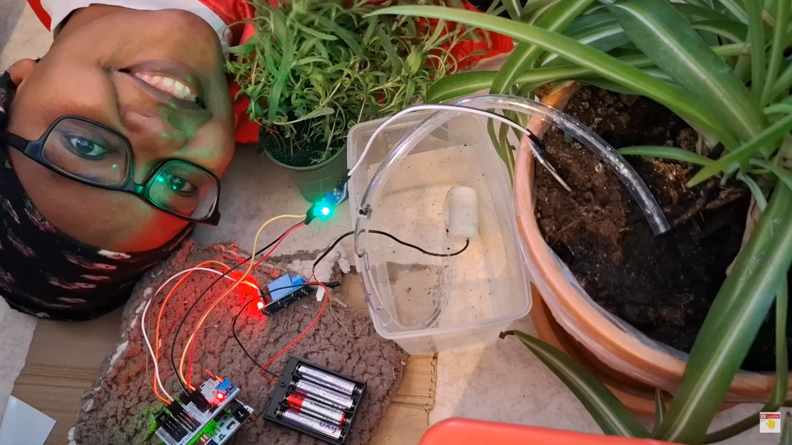
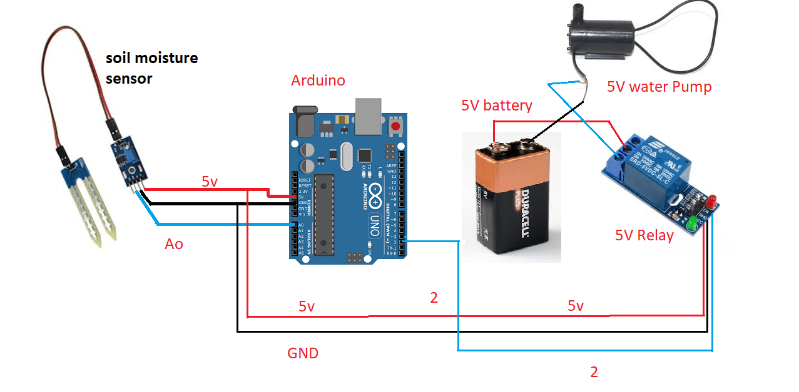
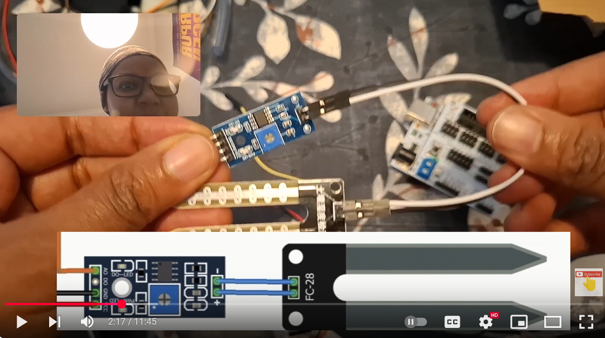

# Smart-Irrigation-System project2
Stop killing your plants by under watering them or over watering them! Instead use Automated Plant Watering System with Arduino IoT.


## Step 1: Gather all the Necessary Components
* Arduino Uno
* Sensor sheild
* Power cable
* Computer
* Electrical tape
* Scissors
* Plant
* Water
* Screw driver
### Self watering system Items: 
* MH Soil Moisture Level Sensor (YL-38 LM393 sensor converter module
...FC-28 hygrometer fork electrode )
* Jumper wire
* Submersible  5v pump water pump ( 2.5-6V)
* Water Pipe  ( inner diameter of 4.7mm)
* Powerbank or any other power source
* Relay 5v
### Software
* Arduino IDE (download IDE from www.arduino.cc/en/) 
* ChatGPT (https://chatgpt.com/)

## Step 2: Connect the Components (use wiring diagrams)


## Step 3: Write Your Code using ChatGPT
``` C++

#define moisturePin A0   // Soil Moisture Sensor Analog Output
#define relayPin 7       // Relay module connected to pin 7

// Moisture Thresholds (Adjust based on testing)
#define dryThreshold 700   // Too dry (Pump ON)
#define wetThreshold 400   // Too wet (Pump OFF)

void setup() {
  pinMode(relayPin, OUTPUT);
  digitalWrite(relayPin, HIGH); // Keep relay OFF initially
  Serial.begin(9600);
}

void loop() {
  int moistureLevel = analogRead(moisturePin); // Read soil moisture (0-1023)

  Serial.print("Soil Moisture Level: ");
  Serial.println(moistureLevel);

  if (moistureLevel > dryThreshold) { // Soil is too dry (High value)
    digitalWrite(relayPin, LOW);  // Turn ON water pump
    Serial.println("Soil is dry - Watering ON 💧");
  } 
  else if (moistureLevel < wetThreshold) { // Soil is too wet (Low value)
    digitalWrite(relayPin, HIGH); // Turn OFF water pump
    Serial.println("Soil is too wet - Watering OFF ❌");
  } 
  else {
    digitalWrite(relayPin, HIGH); // Keep pump OFF in normal range
    Serial.println("Soil moisture is perfect! ✅");
  }

  delay(1000); // Check moisture every second
}

```
## Step 4: Upload and Run
Watch step by step tutorial here :point_down: [](https://youtu.be/US5LRvM9Uxg)


